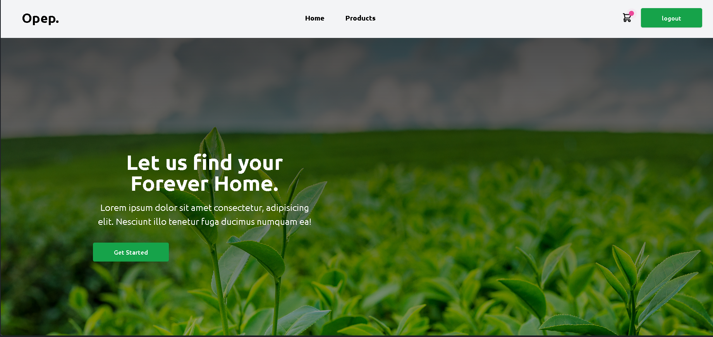
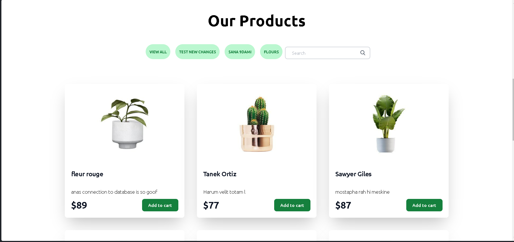
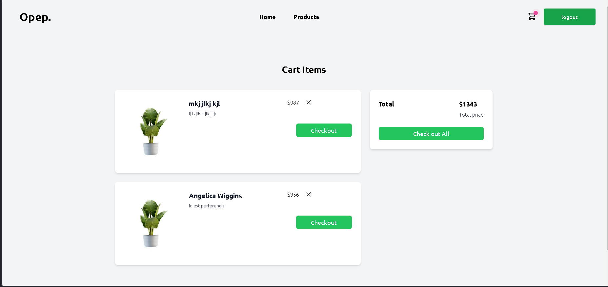
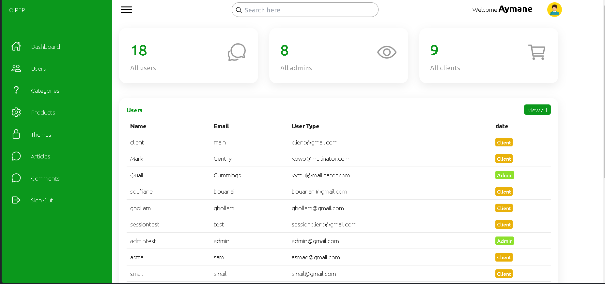
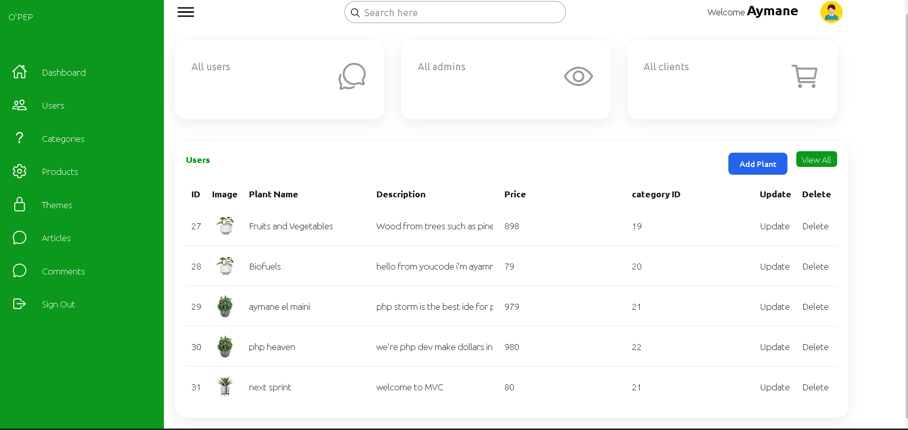
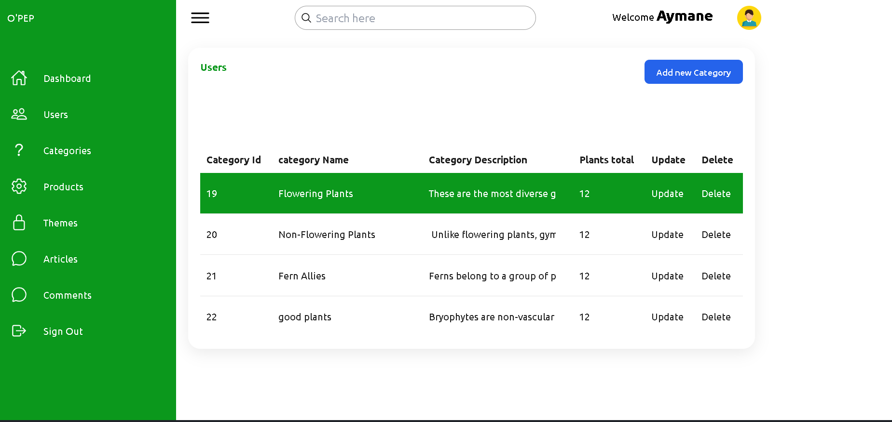
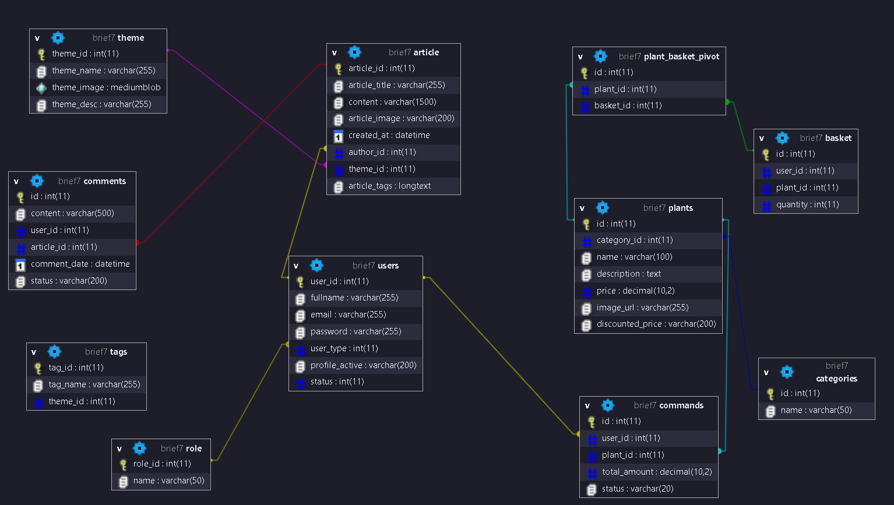
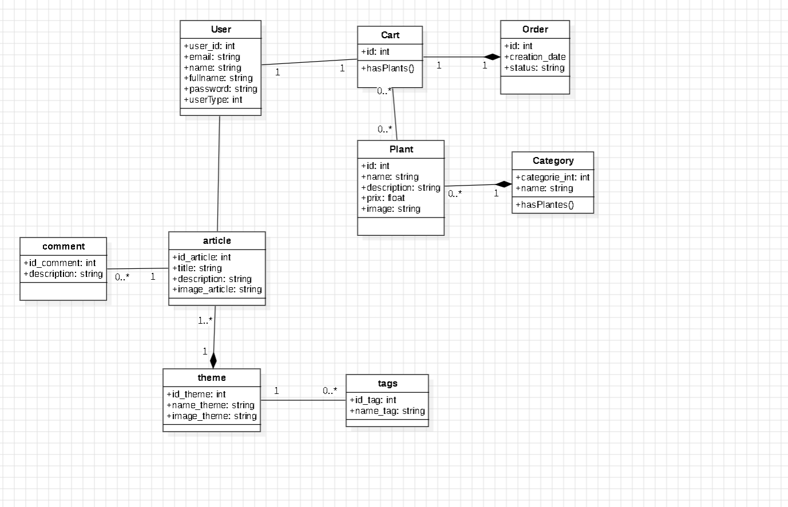

#  O'PEP   

## Un site web écommerce pour une pépinière 

### Contexte du projet

Ce projet consiste à construire un site web pour une pépinière O'PEP en utilisant PHP, avec l'objectif de le rendre facile à utiliser pour tout le monde
## Flow chart for the website 


Clone the project repository:

```bash
> git clone https://github.com/AymaneTech/Opep.V.3.git
```
```bash
> cd Opep.V.3
```
```bash
> code .
```


run the project

```Xampp
> Run the apache & mysql server using XAMPP
```

## Website preview








## Admin Dashboard UI





## Database Design 




## Conception

Diagramme de Classes.




